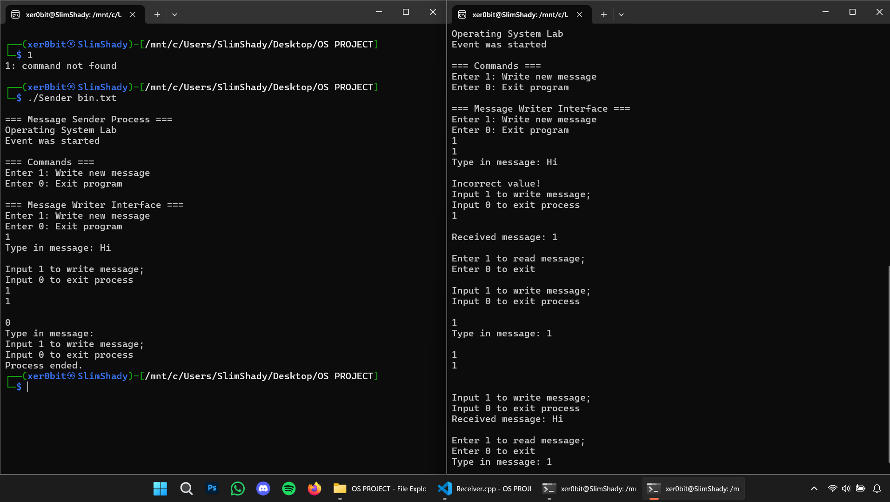

# Operating System Lab Project - Process Communication

## Description
This project implements inter-process communication (IPC) using files and synchronization primitives in C++. It demonstrates a producer-consumer pattern where multiple sender processes can write messages while a single receiver process reads them in a synchronized manner.

## Key Concepts Used

### 1. Inter-Process Communication (IPC)
- File-based communication between processes
- Semaphores for synchronization
- Mutex for exclusive access to shared resources

### 2. Cross-Platform Implementation
- Conditional compilation (#ifdef) for Windows/Linux compatibility
- Platform-specific APIs:
    - Windows: CreateSemaphore, CreateMutex, WaitForSingleObject
    - Linux: sem_open, sem_wait, sem_post

### 3. Synchronization Primitives
- Semaphores for process synchronization
- Mutex for file access control
- Event handling for process coordination

### 4. Process Management
- Process creation and handling
- Command-line argument processing
- File I/O operations

## How to Run

1. **Compile the Project**
   ```bash
   make all
   ```

2. **Start the Receiver Process**
   ```bash
   ./Receiver
   ```
   - Enter the desired binary file name (e.g., messages.txt)
   - Specify maximum number of messages
   - Enter number of sender processes

   3. **Use Sender Processes**
      - Each sender process will launch automatically
      - Type '1' to write a message
      - Type '0' to exit

   4. **Read Messages (Receiver)**
      - Type '1' to read next message
      - Type '0' to exit

   5. **Clean Up**
      ```bash
      make clean
      ```

   ## Screenshot
   
   *Screenshot showing the receiver and multiple sender processes in action*

   Presented to: Mr. Muneeb Saleem

